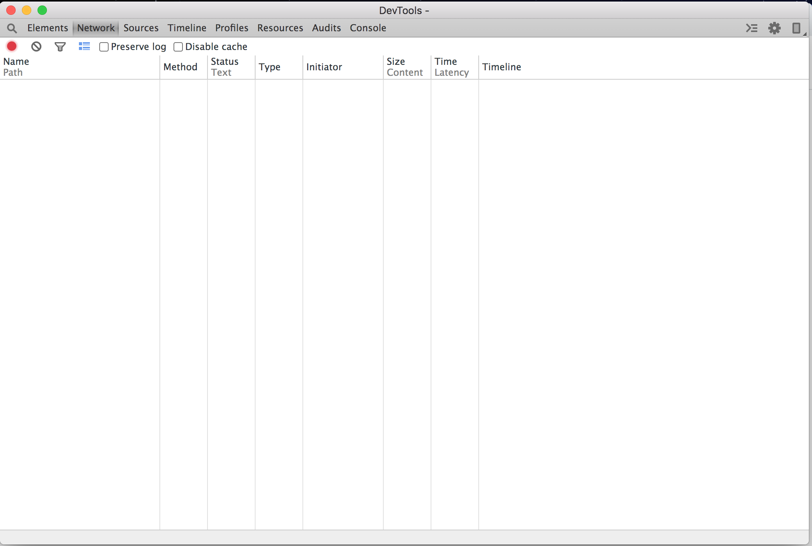

# Stetho的介绍和使用


### 1、简介

stetho是facebook开发的一个开源库，Android应用通过引入stetho，可以在Chrome/Chromium浏览器监控查看网络请求、数据库、SharedPreferences、UI布局层级等。


我觉得最好的一点是查看网络请求，像网页的开发者模式一样，看网络的执行顺序，耗费的时间，请求的参数、返回的数据。只需要装上Chrome/Chromium浏览器，就能直观的查看了，不用再打开Android Studio，调试打印日志，节省我们的时间，提供我们的工作效率，根据网络做特定的优化。


**PS、我们在开发测试时，项目代码引入stetho，便于测试和调试，APP上线版本，这些都要去掉。**


### 2、**Stetho**的引入

**Stetho**库的地址：


[**https://github.com/facebook/stetho**](https://github.com/facebook/stetho)


app项目的gradle引入：

```
//stetho的核心库
implementation 'com.facebook.stetho:stetho:1.6.0'

//监控okhttp的请求
implementation 'com.facebook.stetho:stetho-okhttp3:1.6.0'

```

在APP的Application类中，初始化**Stetho**:

```
public class MyApplication extends Application {
  public void onCreate() {
    super.onCreate();
    //初始化stetho
    Stetho.initializeWithDefaults(this);
  }
}
```

在构建OkHttpClient时，添加网络拦截器：

```
OkHttpClient.Builder builder = new OkHttpClient.Builder();
//添加StethoInterceptor网络拦截器
builder.addNetworkInterceptor(new StethoInterceptor());
okHttpClient = builder.build();
```

### 3、功能介绍


引入**Stetho**后，运行APP，打开Chrome/Chromium浏览器，地址输入：

```
chrome://inspect/#devices
```

如：


点击**inspect**，弹出**DevTools**，如下图：




有如若干个tab页，其中用的最多的是**Network**和**res1**。


在**Network**页，APP发送一个或者多次请求，会有相关请求的详情，我们可以查看网络的执行顺序、耗时情况、参数、返回数据、请求的调度顺序等，对APP就行优化。


相关说明：

* Path：网络请求的URL
* Method：Get或者POST请求
* Status：请求状态码，200正常
* Size：请求的数据大小
* Time：请求的耗时，上一个时间是总耗时，下一个请求的等待时间，两者只差是数据接收和处理时间
* Timeline：请求的的时间线

点击其中一个请求，可以看到请求的详情，header、request、response、cookie等，如下图：


点击**res1**页，可以看APP的数据库、SharedPreferences


* IndexedDB：数据库，可执行SQL语句，查看相应的数据
* Local Storage：SharedPreferences，可直接点击，修改数据

### 4、DevTools的Network页如何展示加密的网络请求？


网络请求在实体网络传输中，可能会被查看到，然后通过脚本模拟网络请求，发起网络攻击。

有些APP会加密请求的参数和加密返回的数据，以到达规避接口被查看的风险，增加安全性。

这时DevTools的Network页，展示的就是被加密的密文，我们就不能直接看到了。有没有办法，使Network页展示的明文（未加密的数据），实际发送时是密文呢？

> 答案是有的


我们知道，OKHttp使用的责任链模式，我们可以添加一个加解密拦截器。在请求发送时，先明文给到stetho展示，然后通过【加解密拦截器】加密请求数据，发送给服务器。在服务器响应后，通过【加解密拦截器】杰密返回数据，给到stetho展示。

分析OKHTTP的RealCall.kt文件（OKHTTP的版本为：4.9.2），拦截器的调用链路代码：

```
  @Throws(IOException::class)
  internal fun getResponseWithInterceptorChain(): Response {
    // Build a full stack of interceptors.
    val interceptors = mutableListOf<Interceptor>()
    interceptors += client.interceptors
    interceptors += RetryAndFollowUpInterceptor(client)
    interceptors += BridgeInterceptor(client.cookieJar)
    interceptors += CacheInterceptor(client.cache)
    interceptors += ConnectInterceptor
    if (!forWebSocket) {
      //这里会用到我们添加的网络拦截器：
      //1、StethoInterceptor
      //2、自定义的加解密拦截器
      interceptors += client.networkInterceptors
    }
    interceptors += CallServerInterceptor(forWebSocket)

    val chain = RealInterceptorChain(
        call = this,
        interceptors = interceptors,
        index = 0,
        exchange = null,
        request = originalRequest,
        connectTimeoutMillis = client.connectTimeoutMillis,
        readTimeoutMillis = client.readTimeoutMillis,
        writeTimeoutMillis = client.writeTimeoutMillis
    )

    var calledNoMoreExchanges = false
    try {
      val response = chain.proceed(originalRequest)
      if (isCanceled()) {
        response.closeQuietly()
        throw IOException("Canceled")
      }
      return response
    } catch (e: IOException) {
      calledNoMoreExchanges = true
      throw noMoreExchanges(e) as Throwable
    } finally {
      if (!calledNoMoreExchanges) {
        noMoreExchanges(null)
      }
    }
  }

```

调用链路流程图：


加解密拦截器示例代码：

```
public class EncryptionInterceptor implements Interceptor {

    private static final String HEADER_NAME_CONTENT_LENGTH = "Content-Length";
    private static final String HEADER_NAME_ACCEPT_ENCODING = "Accept-Encoding";

    private static final String ACCEPT_ENCODING_GZIP_ENCODING = "gzip";

    @Override
    public Response intercept(Chain chain) throws IOException {
        Request request = chain.request();
        Request.Builder requestBuilder = null;

        //加解密秘钥
        //秘钥不为空，我们要进行加解密
        String encryptKey = getEncryptKey(request);

        if (!TextUtils.isEmpty(encryptKey)){
            Headers headers = request.headers();
            String acceptEncoding = headers.get(HEADER_NAME_ACCEPT_ENCODING);
            if (!TextUtils.isEmpty(acceptEncoding) && !TextUtils.equals(acceptEncoding, ACCEPT_ENCODING_GZIP_ENCODING)){
                //response接收的编码类型, 支持zip和空
                requestBuilder = request.newBuilder();
                requestBuilder.removeHeader(HEADER_NAME_ACCEPT_ENCODING);
            }
        }

        //秘钥不为空，且请求body不为空
        if (!TextUtils.isEmpty(encryptKey) && HttpMethod.requiresRequestBody(request.method()) && request.body() != null){
            RequestBody requestBody = request.body();

            //读取请求体的数据
            String body = requestBodyToString(requestBody);

            //加密请求体
            String encryptedBody = encryptBody(encryptKey, body);

            //重新生成请求体
            requestBody = RequestBody.create(requestBody.contentType(), encryptedBody);
            if (requestBuilder == null){
                requestBuilder = request.newBuilder();
            }

            if ("POST".equals(request.method())){
                requestBuilder.post(requestBody);
            } else if ("PUT".equals(request.method())){
                requestBuilder.put(requestBody);
            }

            //复写Content-Length，数据变了，请求的的长度也就变了
            requestBuilder.removeHeader(HEADER_NAME_CONTENT_LENGTH);
            requestBuilder.addHeader(HEADER_NAME_CONTENT_LENGTH, String.valueOf(requestBody.contentLength()));
        }

        if (requestBuilder != null){
            //重新组装request
            request = requestBuilder.build();
        }

        Response response = chain.proceed(request);

        if (TextUtils.isEmpty(encryptKey)){
            //如果不需加解密，直接返回请求响应
            return response;
        }


        String result;
        ResponseBody responseBody = response.body();

        String contentEncoding = response.header(HEADER_NAME_ACCEPT_ENCODING);
        boolean gzipEncoding = ACCEPT_ENCODING_GZIP_ENCODING.equals(contentEncoding);

        //根据请求响应的格式，读取数据
        if (gzipEncoding){
            //读取zip流数据
            GzipSource gzipSource = new GzipSource(responseBody.source());
            BufferedSource bufferedSource = Okio.buffer(gzipSource);
            result = bufferedSource.readUtf8();
        } else {
            result = responseBody.string();
        }

        //解密数据，这里认为是对称加解密
        result = decryptBody(encryptKey, result);

        //重新组装response
        String contentType = response.header("Content-Type");
        long contentLength = result.length();//数据长度发生了变化
        ByteArrayInputStream inputStream = new ByteArrayInputStream(result.getBytes());
        Source source = Okio.source(inputStream);
        return response.newBuilder()
                .body(new RealResponseBody(contentType, contentLength, Okio.buffer(source)))
                .build();
    }

    //读取请求体的数据
    private String requestBodyToString(RequestBody requestBody){
        ByteArrayOutputStream outputStream = new ByteArrayOutputStream();
        BufferedSink bufferedSink = Okio.buffer(Okio.sink(outputStream));
        try {
            requestBody.writeTo(bufferedSink);
        } catch (Exception e){
            e.printStackTrace();
        } finally {
            try {
                bufferedSink.close();
            } catch (IOException e) {
                e.printStackTrace();
            }
        }
        byte[] bytes = outputStream.toByteArray();
        return new String(bytes);
    }


    /**
     * 加解密秘钥
     */
    private String getEncryptKey(Request request){
        //TODO
        return null;
    }

    /**
     * 加密请求体
     */
    private String encryptBody(String encryptKey, String body){
        //TODO
        return null;
    }

    /**
     * 解密数据
     */
    private String decryptBody(String decryptKey, String body){
        //TODO
        return null;
    }
}
```


加解密拦截器的使用：

```
        OkHttpClient.Builder builder = new OkHttpClient.Builder();
        //添加StethoInterceptor网络拦截器
        builder.addNetworkInterceptor(new StethoInterceptor());
        //添加加解密网络拦截器
        builder.addNetworkInterceptor(new EncryptionInterceptor());
        okHttpClient = builder.build();
```

* stetho拦截器在前，加密拦截器在后。chrome看到的明文，实际网络请求是密文

```
builder.addNetworkInterceptor(new StethoInterceptor());
builder.addNetworkInterceptor(new EncryptionInterceptor());
```

* 加密拦截器在前，stetho拦截器在后。chrome看到的和实际网络请求是一样的，都是密文

```
builder.addNetworkInterceptor(new EncryptionInterceptor());
builder.addNetworkInterceptor(new StethoInterceptor());
```


### 5、DevTools弹窗，一直空白，加载不出，或者显示HTTP/1.1 404 Not Found，如图：


> 解决方法：
>
> 需要翻墙，DevTools弹窗需要连接国外网络


### 6、Chrome（谷歌浏览器）打开DevTools，界面显示混乱，各个子页面显示不出来，如图：


> 解决方法：
>
> Chrome（谷歌浏览器）有BUG，打开DevTools有问题，
>
> 1、**换用Chromium浏览器**（推荐）
>
> > Chromium的下载地址：
> >
> > Linux x64: [https://commondatastorage.googleapis.com/chromium-browser-snapshots/index.html?prefix=Linux_x64/827102/](https://commondatastorage.googleapis.com/chromium-browser-snapshots/index.html?prefix=Linux_x64/827102/)
> >
> > Mac OS: [https://commondatastorage.googleapis.com/chromium-browser-snapshots/index.html?prefix=Mac/827102/](https://commondatastorage.googleapis.com/chromium-browser-snapshots/index.html?prefix=Mac/827102/)
> >
> > Windows: [https://commondatastorage.googleapis.com/chromium-browser-snapshots/index.html?prefix=Win/827102/](https://commondatastorage.googleapis.com/chromium-browser-snapshots/index.html?prefix=Win/827102/)
>
> 2、安装老版的Chrome（谷歌浏览器）
>
>
> PS，Stetho官方也有这个问题记录，[https://github.com/facebook/stetho/issues/696](https://github.com/facebook/stetho/issues/696)，感兴趣的可以去看看
